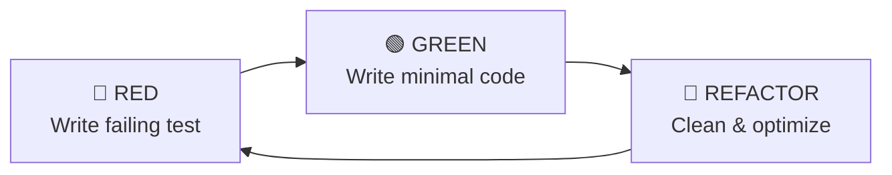

# Engineering Guidelines for AI Agents (Local Project Harness)

## 1. Executive Summary & Purpose

This document serves as the Governing Engineering & Architecture Harness for the local codebase. All contributors, automated coding agents, and local modules must strictly adhere to the standards, patterns, testing disciplines, and documentation practices outlined herein.

Our local engineering baseline prioritizes:

- **Maintainability & Readability:** Code is written for humans first and machines second.
- **Robust Verification:** Test-Driven Development (TDD) as the primary design driver.
- **Modular & Decoupled Architecture:** Strict adherence to SOLID, DRY, and Clean Code standards.
- **Local Resilience:** Safe execution, atomic file writes, deterministic state handling, and simple rollback mechanisms.
- **Living Documentation:** Self-explanatory, contract-driven, and maintained alongside code.
- **Context Engineering for AI Assistance:** Disciplined, guardrailed, and specification-first AI-assisted workflows.

---

## 2. Core Architectural & Operational Pillars

```text
┌────────────────────────────────────────────────────────────────────────────────────────┐
│                              LOCAL ENGINEERING HARNESS                                 │
├─────────────────────┬─────────────────────┬────────────────────┬───────────────────────┤
│     Clean Code      │         DRY         │       SOLID        │     Documentation     │
│   (Readability &    │   (Abstraction &    │   (Decoupling &    │   (Living Docs, ADRs  │
│      Semantics)     │  Non-Duplication)   │    Modularity)     │     & Type Safety)    │
├─────────────────────┴─────────────────────┴────────────────────┴───────────────────────┤
│                         Test-Driven Development (TDD)                                  │
│                       (Red ➔ Green ➔ Refactor Workflow)                                │
├────────────────────────────────────────────────────────────────────────────────────────┤
│                           Local Resilience & Safety                                    │
│                   (Idempotency, Atomic Writes & Safe Rollbacks)                        │
├────────────────────────────────────────────────────────────────────────────────────────┤
│                       AI-Assisted & Agentic Engineering                                │
│                   (Context Engineering, Guardrails & Quality Gates)                    │
└────────────────────────────────────────────────────────────────────────────────────────┘
```

---

## 3. Clean Code & Idiomatic Standards

### 3.1 Naming Conventions & Semantics
- **Functions & Variables:** `snake_case` (e.g., `calculate_pension_allowance`, `weeks_accumulator`).
- **Classes & Types:** `PascalCase` (e.g., `PensionCalculator`, `TransitionRuleEngine`).
- **Constants:** `UPPER_SNAKE_CASE` (e.g., `MIN_WEEKS_COLPENSIONES`, `DEFAULT_RETIREMENT_AGE_MALE`).
- **Intention-Revealing Names:** Avoid cryptic abbreviations (e.g., prefer `simulation_context` over `sim_ctx` or `sc`).
- **Boolean Variables:** Prefix with state verbs (e.g., `is_eligible`, `has_transition_regime`, `should_apply_reduction`).

### 3.2 Typing & Data Modeling
- **Mandatory Type Hints:** All public functions, method signatures, and return values must specify static types.
- **Structured Data:** Use immutable records or typed validation schemas (e.g., `@dataclass(frozen=True)` or `pydantic.BaseModel`) for data transfer objects (DTOs) and domain schemas instead of raw, untyped dictionaries.
- **Context Managers:** Enforce deterministic resource management (files, local database connections, locks) using managed resource scopes (`with` blocks).

### 3.3 Idiomatic Error Handling
- **Explicit Exceptions:** Prefer explicit exception handling over blanket defenses when idiomatic.
- **No Blanket Catches:** Never suppress errors silently without handling or logging (`except: pass`). Catch explicit, custom domain exceptions.
- **Domain Exceptions:** Define a hierarchy of domain-specific exceptions rooted in a base class (e.g., `class PensionCalculationError(Exception)`).

---

## 4. DRY (Don't Repeat Yourself) & Local Operational Execution

### 4.1 Abstraction & Reusability
- **Composability over Inheritance:** Share reusable logic through small, composable functions and dependency injection rather than deep inheritance hierarchies.
- **Pure Domain Calculations:** Business calculation rules (e.g., IBL, replacement rate, weekly reductions) must be pure functions with zero side-effects.

### 4.2 Local Safety & Rollback Plan
Before writing or executing any automation or destructive script:
1. **Rollback Strategy Definition:** A clear procedure to restore the workspace to its pre-execution state (e.g., Git branch/stash or file backups).
2. **State Preservation / Backups:**
   - For file modifications or generated outputs, store a pre-execution copy in a local `backups/` directory or rely on Git tracking.
   - For local SQLite/DuckDB databases, ensure snapshots or transactional rollback.
3. **Fail-Fast Policy:** Terminate immediately on unhandled fatal errors:
   - **PowerShell:** `$ErrorActionPreference = 'Stop'`
   - **Python:** Strict exception hierarchies with non-zero exit codes (`sys.exit(1)` on error, `sys.exit(0)` on success).
4. **Configuration & Secrets:**
   - Store local parameters and sensitive keys in `.env` or `config/` (both excluded via `.gitignore`).
   - Zero hardcoded paths with user-specific hardcoded drive letters; resolve paths relative to `Path(__file__).resolve().parent` or workspace root.

### 4.3 Step-by-Step Logging
- Use standard Python `logging` or PowerShell console output with timestamps and severity levels:
  ```text
  [YYYY-MM-DD HH:MM:SS] [LEVEL] [Step X/N] <Action Description>
  ```
- Keep logs local: output to standard console streams (`stdout`/`stderr`) and persist into `logs/` when executing batch or migration scripts.

---

## 5. Local Resilience & State Recovery

For long-running local scripts (e.g., data migrations, bulk simulations):

### 5.1 Idempotency Guarantee
Every step or script execution must be idempotent: re-running with the same input must produce the exact same final state without duplicates or corruptions.

### 5.2 Atomic File Writes
When saving critical local files (JSON, configs, data caches), write to a temporary file first and atomically replace the destination to prevent file corruption during an interrupted process:
```python
import json
from pathlib import Path
import tempfile

def atomic_write_json(file_path: Path, data: dict) -> None:
    file_path.parent.mkdir(parents=True, exist_ok=True)
    with tempfile.NamedTemporaryFile("w", dir=file_path.parent, delete=False, encoding="utf-8") as tf:
        json.dump(data, tf, indent=2, ensure_ascii=False)
        temp_name = tf.name
    Path(temp_name).replace(file_path)
```

### 5.3 Execution Modes: Dry-Run Support
Scripts that make significant local mutations should support a `--dry-run` flag to verify calculations and preconditions without persisting changes to disk or database.

---

## 6. SOLID Principles

### S — Single Responsibility Principle (SRP)
Every module, class, and function must have one, and only one, reason to change.
Separate pension calculation logic, data persistence, and presentation/UI layers into distinct modules.

### O — Open/Closed Principle (OCP)
Software entities must be open for extension, but closed for modification.
Use polymorphism and Strategy patterns (e.g., `ColpensionesRegimeStrategy`, `PrivateFundStrategy`, `PillarsStrategy`) instead of deeply nested conditional branches.

### L — Liskov Substitution Principle (LSP)
Subtypes must be substitutable for their base contracts without breaking application invariants.
Never raise `NotImplementedError` for supported operations in derived implementations.

### I — Interface Segregation Principle (ISP)
Favor small, granular protocols using structural typing (`typing.Protocol`) rather than monolithic base classes.

```python
from typing import Protocol

class PensionSimulator(Protocol):
    def simulate(self, profile: "UserProfile") -> "SimulationResult": ...

class WeekCalculator(Protocol):
    def calculate_total_weeks(self, cotizaciones: list["CotizacionRecord"]) -> int: ...
```

### D — Dependency Inversion Principle (DIP)
High-level modules must depend on abstractions (Protocols / Abstract Interfaces), not concrete implementations.
Inject dependencies (calculators, data stores, clocks) via constructor arguments.

---

## 7. Test-Driven Development (TDD) Discipline

All production calculation engines and business logic must be developed using the Red-Green-Refactor discipline.



### 7.1 The Three Laws of TDD
1. You may not write any production code until you have written a failing unit test.
2. You may not write more of a unit test than is sufficient to fail.
3. You may not write more production code than is sufficient to pass the currently failing test.

### 7.2 Test Anatomy: AAA Pattern
- **Arrange:** Set up inputs, user profile, and test parameters.
- **Act:** Execute the calculation or rule under test.
- **Assert:** Validate results, monetary amounts, and eligibility flags.

### 7.3 Testing Rules
- **Deterministic & Fast:** Unit tests must execute in memory without external network requests or unnecessary disk I/O.
- **Edge Cases First:** Explicitly test boundary conditions (e.g., exact retirement age cutoffs, minimum wage thresholds, transition week cutoffs at 750/900 weeks).

---

## 8. Documentation Standards & Living Documentation

### 8.1 Code-Level Documentation (Docstrings)
- Explain the legal and business context ("why"), not just the mechanics ("what").
- Reference relevant statutory articles (e.g., Ley 100 de 1993 Art. 33, Ley 2381 de 2024 Art. 12) in calculation docstrings.

```python
def calculate_replacement_rate(weeks: int) -> float:
    """Calculates the replacement rate (tasa de reemplazo) according to statutory rules.

    Args:
        weeks: Total validated contribution weeks (semanas cotizadas).

    Returns:
        Percentage of IBL applicable as pension base (between 0.65 and 0.80).

    References:
        Ley 797 de 2003, Art. 10 amending Ley 100 de 1993, Art. 34.
    """
```

### 8.2 Architecture Decision Records (ADRs)
Store critical architecture decisions under `docs/adr/` with Title, Context, Decision, and Consequences.

---

## 9. AI-Assisted Development Best Practices

- **Specification-First:** Define DTO schemas, domain models, and protocols before generating implementation code.
- **TDD as Anti-Hallucination Guardrail:** Write unit tests first to verify calculation accuracy against Colombian statutory rules.
- **Local Quality Gates:** Verify all generated code with `pytest`, `ruff`, and `mypy` locally before finalizing.

---

## 10. Local Tooling & Quality Stack

| Role | Tool | Local Command |
| :--- | :--- | :--- |
| **Linting & Formatting** | `ruff` | `ruff check .` / `ruff format .` |
| **Static Type Checking** | `mypy` | `mypy --strict .` |
| **Automated Testing** | `pytest` | `pytest -v` |
| **Test Coverage** | `pytest-cov` | `pytest --cov=src tests/` |

---

## 11. Standard Local Task Template (`tasks/<task_name>/run.py`)

```python
#!/usr/bin/env python3
"""
Standard Local Task Automation Script.
Conforms to the Local Project Harness.
"""

import sys
import logging
from pathlib import Path

TASK_DIR = Path(__file__).resolve().parent
LOG_DIR = TASK_DIR / "logs"
LOG_DIR.mkdir(parents=True, exist_ok=True)

logging.basicConfig(
    level=logging.INFO,
    format="[%(asctime)s] [%(levelname)s] %(message)s",
    datefmt="%Y-%m-%d %H:%M:%S",
    handlers=[
        logging.StreamHandler(sys.stdout),
        logging.FileHandler(LOG_DIR / "task.log", encoding="utf-8")
    ]
)

def main(dry_run: bool = False) -> int:
    try:
        logging.info(f"Starting local task execution (dry_run={dry_run})...")
        # Step 1: Pre-execution checks
        logging.info("[Step 1/2] Verifying prerequisites...")
        
        # Step 2: Main local workload
        logging.info("[Step 2/2] Processing workload...")
        
        logging.info("Task completed successfully.")
        return 0
    except Exception as exc:
        logging.error(f"Task execution failed: {exc}", exc_info=True)
        return 1

if __name__ == "__main__":
    is_dry_run = "--dry-run" in sys.argv
    sys.exit(main(dry_run=is_dry_run))
```

---

## 12. Definition of Done (DoD) for Local Tasks

A feature or task is considered Done when:
- **TDD Compliance:** Tests were written and pass with `pytest`.
- **Type Safety:** Public functions and classes have static type annotations verified by `mypy`.
- **Clean Linter:** `ruff` runs cleanly with zero unaddressed warnings.
- **Documentation Updated:** Relevant docstrings and architectural references reflect the change.
- **No External/Cloud Assumptions:** The solution runs self-contained in the local development environment.
