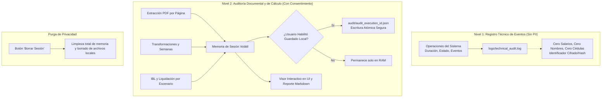

# Sistema de Auditoría y Trazabilidad Paso a Paso

El sistema de auditoría de **MiPensiónCO** fue diseñado para garantizar la transparencia algorítmica y la explicabilidad jurídica completa del proceso pensional, protegiendo estrictamente la privacidad del afiliado mediante una arquitectura desacoplada en dos niveles.

---

## 1. Arquitectura en Dos Niveles

### Nivel 1: Registro Técnico de Eventos (Sin PII)
- **Destino:** `logs/technical_audit.log`.
- **Contenido:** Marcas de tiempo ISO en UTC, identificador de ejecución, componente (`ColpensionesPDFReader`, `PensionEngine`, `AuditService`), duración en milisegundos, severidad (`INFO`, `ADVERTENCIA`, `BLOQUEADO`, `ERROR`), código de evento (`EventCode`), estado (`COMPLETADO`, `BLOQUEADO`), causa técnica y acción requerida.
- **Garantía de Privacidad:** Jamás incluye nombres de personas o empresas, números de documento, semanas acumuladas, valores de IBC ni montos de mesada.

### Nivel 2: Auditoría de Cálculo y Documental
- **Destino:** Memoria de sesión activa (`AuditService._active_audits`).
- **Persistencia Voluntaria:** Si el usuario activa el guardado local, se almacena en `audit/audit_<execution_id>.json` utilizando reemplazo atómico de archivo temporal (`tempfile.NamedTemporaryFile`) para evitar corrupción ante apagones.
- **Cuatro Secciones Auditables:**
  1. **Qué extrajo del PDF:** Detalle de cada página, método (`TEXTO_DIRECTO` u `OCR_LOCAL`), cantidad de caracteres, fragmentos detectados, campos estructurados identificados y líneas no interpretadas.
  2. **Qué transformó:** Saneamiento contra inyecciones XSS, cómputo de semanas calendario (SL138-2024), consolidación de empleadores simultáneos en el mismo mes calendario (Finding 2.7) y exclusión de aportes posteriores a horizontes históricos (Finding 2.8).
  3. **Qué calculó:** Comparativa de métodos IBL (10 años de aportes efectivos vs promedio de toda la vida laboral), factores de ajuste IPC oficiales y proyectados, tasa de reemplazo según fórmula Ley 797 Art. 10 (con bloques completos de 50 semanas), topes legales mínimo y máximo, y descuentos en salud y subsistencia.
  4. **Por qué un escenario produjo determinado resultado o quedó bloqueado:** Detalle paso a paso de las condiciones jurídicas (ej. cumplimiento de umbral C-264 al 1 de abril de 2027, déficit de semanas a la edad ordinaria que impide liquidar mesada, o bloqueo por falta de registros salariales).

---

## 2. Códigos de Eventos Técnicos (`EventCode`)

| Código de Evento | Severidad Habitual | Significado Operativo |
| :--- | :--- | :--- |
| `PDF_CARGADO` | `INFO` | Documento PDF procesado correctamente con capas de texto legibles. |
| `PDF_VACIO` | `ADVERTENCIA` | Documento escaneado sin texto o completamente en blanco. |
| `PDF_PROTEGIDO_CLAVE` | `ADVERTENCIA` | Archivo PDF requiere contraseña de apertura. |
| `PDF_CORRUPTO` | `ERROR` | Archivo incompleto o con cabeceras dañadas. |
| `IBC_AMBIGUO` | `ADVERTENCIA` | Fila con montos ambiguos no identificables con certeza. |
| `COBERTURA_PARCIAL_INCIERTA` | `ADVERTENCIA` | Días cotizados no especificados explícitamente en el registro. |
| `SIMULTANEIDAD_DETECTADA` | `INFO` | Más de un aportante en el mismo mes calendario; unificados según Ley 100. |
| `DISCREPANCIA_RESUMEN_DETALLE` | `ADVERTENCIA` | Diferencia entre semanas del encabezado y la suma de días calendario. |
| `IPC_FALTANTE` | `ADVERTENCIA` | Consulta de período anterior a 1990 sin serie de empalme oficial DANE. |
| `TRANSICION_EVIDENCIA_SUFICIENTE` | `INFO` | Acredita umbral antes del 1 de abril de 2027; conserva Ley 100. |
| `TRANSICION_NO_CUMPLE` | `INFO` | Información completa reportada no alcanza el umbral de semanas al corte. |
| `TRANSICION_INFO_INSUFICIENTE` | `ADVERTENCIA` | Semanas inferiores con períodos faltantes o reporte posterior sin detalle. |
| `IBL_INSUFICIENTE_DATOS_SALARIALES` | `ADVERTENCIA` | Semanas acreditadas pero sin salarios; cálculo de mesada bloqueado. |
| `DEFICIT_SEMANAS_HORIZONTE` | `INFO` | Faltan semanas a la edad legal; no se calcula mesada pagadera. |
| `SIMULACION_COMPLETADA` | `INFO` | Escenario liquidado exitosamente con todas las operaciones verificadas. |
| `SESION_BORRADA` | `INFO` | Purgado voluntario de memoria y archivos de auditoría locales. |

---

## 3. Endpoints de la API de Auditoría

- `GET /api/audit/{execution_id}`: Retorna el registro JSON íntegro de la auditoría documental y de cálculo.
- `POST /api/audit/{execution_id}/save-local`: Persiste localmente la auditoría en `audit/audit_{execution_id}.json` con confirmación de ruta en disco.
- `GET /api/audit/{execution_id}/report.md`: Genera y sirve en formato Markdown un informe diagnóstico estructurado y legible por personas.
- `POST /api/reset-session?execution_id={execution_id}`: Purga inmediatamente los datos en memoria y elimina los archivos JSON de auditoría del disco local.
