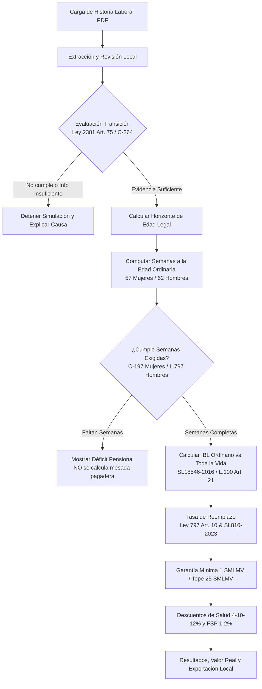

# Metodología de Cálculo Pensional y Límites Legales

## 1. Alcance y Filosofía del Producto

**MiPensiónCO** es un simulador pensional determinista y estrictamente local diseñado para afiliados a **Colpensiones** que conservan el régimen de transición de la **Ley 100 de 1993 y sus modificaciones (Ley 797 de 2003)**, amparados por el artículo 75 de la Ley 2381 de 2024 y la modulación de vigencia establecida en la Sentencia **C-264 de 2026** de la Corte Constitucional.

> **AVISO LEGAL OBLIGATORIO:**  
> Este producto genera una estimación estrictamente informativa basada en los datos documentales acreditados y los supuestos económicos indicados. El reconocimiento, liquidación y pago efectivo de cualquier prestación pensional corresponde exclusivamente a la Administradora Colombiana de Pensiones (Colpensiones).

---

## 2. Reglas Jurídicas y Algoritmo de Liquidación

### 2.1 Evaluación del Régimen de Transición (Artículo 75 Ley 2381 / C-264 de 2026)
- **Umbral:**
  - Mujeres: Mínimo 750 semanas cotizadas antes de la fecha de corte.
  - Hombres: Mínimo 900 semanas cotizadas antes de la fecha de corte.
- **Fecha de Corte:** Fijada para el **1 de abril de 2027** de conformidad con el resolutivo cuarto de la Sentencia C-264 de 2026 de la Corte Constitucional.
- **Regla de Exclusión:** Semanas cotizadas con posterioridad a la fecha de corte no se computan para alcanzar el umbral de transición.
- **Información Incompleta:** Si el total es inferior pero se declaran períodos faltantes o no certificados, el sistema declara `INFORMACION_INSUFICIENTE` y no concluye falsamente una exclusión.

### 2.2 Cómputo de Semanas (Días Calendario vs Mes Comercial)
- De acuerdo con la jurisprudencia de la Sala de Casación Laboral de la Corte Suprema de Justicia (**Sentencia SL138-2024**):
  - El mes comercial de 30 días aplica para la facturación de aportes patronales.
  - La contabilización de semanas para la pensión se realiza por **días calendario reales** (cada 7 días calendario de cotización efectiva equivalen a una semana).
  - En caso de empleadores simultáneos en el mismo día calendario, **no se duplican los días**.
  - Se reconocen los años bisiestos (ej. 29 de febrero de 2024).

### 2.3 Requisitos de Edad y Semanas para Pensión Ordinaria de Vejez
- **Hombres:** 62 años de edad y 1.300 semanas ordinarias (Ley 797 de 2003, Art. 9).
- **Mujeres:** 57 años de edad. En aplicación de la Sentencia **C-197 de 2023** y la confirmación operativa de Colpensiones, el requisito de semanas se reduce progresivamente según el año de cumplimiento de los 57 años:
  - 2025: 1.300 semanas
  - 2026: 1.250 semanas
  - 2027: 1.225 semanas
  - 2028: 1.200 semanas
  - 2029: 1.175 semanas
  - 2030: 1.150 semanas
  - 2031: 1.125 semanas
  - 2032: 1.100 semanas
  - 2033: 1.075 semanas
  - 2034: 1.050 semanas
  - 2035: 1.025 semanas
  - 2036 en adelante: 1.000 semanas

### 2.4 Ingreso Base de Liquidación (IBL)
- **Regla General (10 Años Efectivos):** Conforme a la Sentencia **SL18546-2016**, los 10 años corresponden a los últimos 3.650 días de **cotizaciones efectivas**, indexados mes a mes con el IPC del DANE y ponderados por el tiempo cotizado. No se toman mecánicamente meses calendario vacíos como ceros.
- **Opción de Toda la Vida Laboral:** Procede según el artículo 21 de la Ley 100 de 1993 únicamente cuando el afiliado acredite al menos **1.250 semanas cotizadas** y el promedio de toda la vida actualizado resulte superior al de los últimos 10 años. La reducción de semanas para mujeres no rebaja este umbral específico de 1.250 semanas.

### 2.5 Tasa de Reemplazo y Mesada Bruta (Ley 797 Art. 10 y SL810-2023)
- Relación con el salario mínimo de retiro: $s = \frac{\text{IBL}}{\text{SMLMV}}$.
- Tasa inicial: $r_{\text{inicial}} = 65.50\% - 0.50 \times s$.
- Incremento por semanas adicionales: $+1.5\%$ por cada bloque completo de **50 semanas** adicionales a las mínimas requeridas.
- **Jurisprudencia SL3501-2022 y SL810-2023:** No existe tope universal de 1.800 semanas; las semanas adicionales a 1.800 se computan para alcanzar el tope máximo del **80.00%**.
- **Límites Legales de Mesada:**
  - Garantía de Pensión Mínima: Ninguna pensión puede ser inferior a **1 SMLMV**.
  - Tope Máximo: Ninguna pensión en Colpensiones puede exceder **25 SMLMV**.

### 2.6 Descuentos de Ley a Pensionados
- **Aporte a Salud:**
  - Mesada igual a 1 SMLMV: **4.0%**
  - Mesada superior a 1 y hasta 3 SMLMV: **10.0%**
  - Mesada superior a 3 SMLMV: **12.0%**
- **Fondo de Solidaridad Pensional (Subcuenta de Subsistencia):**
  - Mesadas entre 10 y 20 SMLMV: **1.0%**
  - Mesadas superiores a 20 SMLMV: **2.0%**
