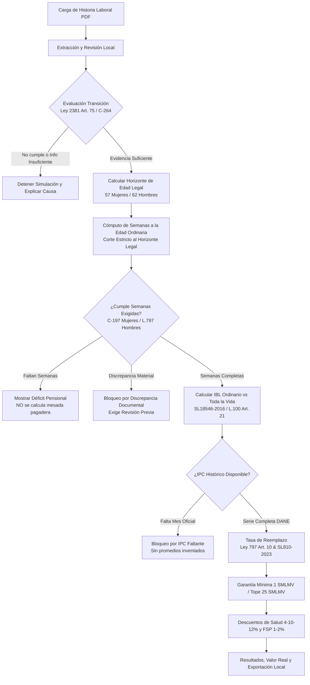

# Metodología de Cálculo Pensional y Límites Legales

## 1. Alcance y Filosofía del Producto

**MiPensiónCO** es un simulador pensional determinista y estrictamente local diseñado para afiliados a **Colpensiones** que conservan el régimen de transición de la **Ley 100 de 1993 y sus modificaciones (Ley 797 de 2003)**, amparados por el artículo 75 de la Ley 2381 de 2024 y la modulación de vigencia establecida en la Sentencia **C-264 de 2026** de la Corte Constitucional.

> **AVISO LEGAL OBLIGATORIO:**  
> Este producto genera una estimación estrictamente informativa basada en los datos documentales acreditados y los supuestos económicos indicados. El reconocimiento, liquidación y pago efectivo de cualquier prestación pensional corresponde exclusivamente a la Administradora Colombiana de Pensiones (Colpensiones).

---

## 2. Reglas Jurídicas y Algoritmo de Liquidación

### 2.1 Evaluación del Régimen de Transición (Artículo 75 Ley 2381 / C-264 de 2026)
- **Umbral:**
  - Mujeres: Mínimo 750 semanas cotizadas antes de la fecha de corte.
  - Hombres: Mínimo 900 semanas cotizadas antes de la fecha de corte.
- **Fecha de Corte:** Fijada para el **1 de abril de 2027** de conformidad con el resolutivo cuarto de la Sentencia C-264 de 2026 de la Corte Constitucional.
- **Regla de Exclusión:** Semanas cotizadas con posterioridad a la fecha de corte no se computan para alcanzar el umbral de transición.
- **Información Incompleta:** Si el total es inferior pero se declaran períodos faltantes o no certificados, el sistema declara `INFORMACION_INSUFICIENTE` y no concluye falsamente una exclusión.

### 2.2 Cómputo de Semanas y Separación de Convenciones (CSJ SL138-2024)
- **Semanas por días calendario reales:** La semana pensional se determina por días calendario efectivos divididos entre 7 (7 días = 1 semana). Enero completo equivale a 31 días (4.4285 semanas), febrero en año bisiesto a 29 días (4.1428 semanas) y meses de 30 días a 4.2857 semanas.
- **Convención comercial de 30 días:** Aplica estrictamente para la facturación de aportes patronales e indexación de IBC mensual, no como límite superior de días calendario.
- **Períodos parciales:** Se computa `min(dias_cotizados, span_dias)` para no sobreestimar semanas.
- **No duplicación por simultaneidad:** Dos o más aportantes en el mismo día calendario se unifican sin duplicar días.
- **Pausas parciales sin eliminación de mes:** Las pausas dentro de un mes se descuentan restando únicamente los días calendario en que hubo suspensión efectiva de aportes (`active_cal_days = span_cal_days - paused_days`), unificando previamente intervalos de pausas que se superpongan para evitar dobles deducciones.

### 2.3 Proyección Futura y No Invasión del Pasado Desconocido
- **Horizonte fijo:** Las semanas y el IBL se calculan a la fecha exacta de cumplimiento de la edad legal ordinaria (57 años mujeres, 62 años hombres). No se proyectan aportes posteriores a esa fecha.
- **Proyecciones futuras estrictamente hacia adelante:** Las proyecciones hipotéticas de escenarios (`semanas_futuras_proyectadas`) inician estrictamente después de la fecha de evaluación (`today`). No se generan aportes futuros sobre el pasado desconocido entre el último certificado y el presente.
- **Aportes declarados:** Si el usuario ingresa un escenario con fecha de inicio anterior a la evaluación, los períodos entre el último reporte y la evaluación se modelan y auditan por separado como aportes declarados (`ProvenanceType.DECLARACION_USUARIO`).
- **Exclusión de cotizaciones post-horizonte:** Para afiliados que ya cumplieron la edad legal ordinaria en el pasado, todas las cotizaciones con `periodo_inicio > fecha_cumplimiento_edad_legal` se excluyen de la liquidación a la edad legal. Los registros que cruzan la fecha de cumplimiento de edad se prorratean exactamente hasta el día de cumpleaños.

### 2.4 No Selección Arbitraria de Semanas (Documental vs Recálculo)
- Se eliminó el uso de `base_weeks = max(semanas_doc, semanas_cal)`.
- El sistema mantiene separados:
  1. `semanas_acreditadas_documentales`: total certificado por Colpensiones en el resumen del PDF.
  2. `semanas_recalculadas_calendario`: sumatoria real de días calendario dividida entre 7 de los períodos desglosados.
- **Criterio de Discrepancia:** Si el resumen documental no alcanza el umbral de semanas exigidas pero el recálculo sí lo supera, o si la diferencia altera un bloque completo de 50 semanas para incrementos de tasa de reemplazo, el sistema marca `requiere_revision_discrepancia = True`, advierte al afiliado y bloquea el reconocimiento automático de la mesada hasta que se aclare la consistencia probatoria.

### 2.5 Indexación con IPC Oficial y Tratamiento de Meses Faltantes
- Toda actualización de bases salariales utiliza la serie oficial de empalme histórico del DANE (Base Diciembre 2018 = 100) mes a mes.
- **Cero promedios inventados:** Se eliminó cualquier sustitución silenciosa de meses faltantes por promedios anuales.
- Si un mes histórico requerido para liquidar los 10 años o toda la vida laboral no existe en la serie oficial verificada, el motor lanza `IPCFaltanteError` y devuelve un resultado bloqueado transparente (`bloqueado_por_ipc = True`), explicando la causa al usuario.

---

## 3. Límites Legales y Descuentos Obligatorios

| Concepto | Fundamento Legal | Límite / Porcentaje Aplicable |
| :--- | :--- | :--- |
| **Pensión Mínima** | Ley 100 de 1993, Art. 35 | Ninguna pensión puede ser inferior a **1 SMLMV** del año de retiro. |
| **Pensión Máxima** | Ley 797 de 2003, Art. 18 par. 1 / Acto Leg. 01/2005 | Ninguna pensión pública puede superar **25 SMLMV** vigentes. |
| **Tope de Tasa** | CSJ SL810-2023 / Ley 797 Art. 10 | Las semanas sobre 1.800 incrementan la tasa en 1.5% por cada 50 semanas hasta el tope absoluto del **80.00%**. |
| **Aporte a Salud** | Ley 2010 de 2019 / Ley 2294 de 2023 | 4% para mesadas de 1 SMLMV; 10% para >1 hasta 3 SMLMV; 12% para >3 SMLMV. |
| **Fondo Solidaridad (FSP)** | Ley 100 de 1993, Art. 27 / D. 1833 de 2016 | 0% hasta 10 SMLMV; 1% para >10 hasta 20 SMLMV; 2% para >20 SMLMV. |

## Corrección de escenarios y superposiciones (27 de septiembre de 2026)

Cada simulación crea un proyector económico independiente con la inflación y el crecimiento del salario mínimo de su escenario, preservando la fecha base configurada. Se utiliza en los límites del IBC futuro, la consolidación para IBL, el salario mínimo de referencia y la conversión a pesos reales. Reutilizar el motor no mezcla supuestos entre escenarios.

Las declaraciones solo añaden días que no están cubiertos por los intervalos documentales ni por otras declaraciones. Las superposiciones quedan pendientes de revisión y bloquean la mesada y sus descuentos: podrían representar una corrección o un empleador simultáneo y no deben duplicar salarios en el IBL. Se conserva la evidencia original. Si una declaración parcial se superpone, no se le asignan fechas exactas inventadas ni semanas adicionales hasta aclarar su cobertura. El desglose de auditoría incluye `declaradas_adicionales`.

Pruebas de regresión: `tests/test_scenario_economics_and_overlap.py`. Incluyen crecimiento cero y 20 %, reutilización del motor, inflación para pesos reales, superposiciones totales/parciales y bloqueo aun cuando se reúnen las semanas mínimas.

## Consistencia de revisión y transición

La pantalla de revisión reutiliza el conteo calendario del motor: unión de días, exclusiones y truncamiento de semanas, sin sumar empleadores simultáneos ni redondear hacia arriba. Las correcciones de IBC conservan la cobertura del registro revisado. Las declaraciones muestran únicamente días adicionales no superpuestos.

Una discrepancia de al menos una semana, o menor si cruza el umbral de transición o el requisito/bloques aplicables al horizonte, impide confirmar la revisión. Se devuelve el diagnóstico sin incrementar la versión ni registrar una confirmación exitosa. Debe completarse o corregirse el detalle con soporte; no se ofrece aceptación automática de la diferencia.

La evaluación de transición omite los registros excluidos. Si existen exclusiones, el resumen permanece intacto como evidencia original, pero no puede reincorporar silenciosamente los períodos retirados: el cumplimiento debe sostenerse con los registros activos. Si estos no bastan, se informa insuficiencia documental.

Pruebas: `tests/test_review_consistency.py`; Chromium cubre tanto el bloqueo de un reporte incompleto como el avance de una historia sintética completa.

### Extracción de tablas oficiales por celdas

El lector reconoce las columnas numeradas del resumen [1]-[9] y del detalle
[34]-[46], incluso con texto multilínea. El período AAAAMM determina el mes;
la fecha de pago se conserva separadamente. Días reportados, días cotizados e IBC
se leen de sus propias columnas. Cada fila conserva página, coordenadas y texto
original en la auditoría. No se usa el último salario del resumen como IBC histórico.

La ausencia de detalle activo bloquea la conciliación. Una respuesta HTTP fallida
o incompleta tampoco puede producir el aviso de conciliación consistente.
El recálculo calendario puede diferir del resumen certificado: esa diferencia se
muestra y requiere revisión, sin modificar el certificado ni inventar fechas exactas
para días parciales dentro de un mes. Esta corrección del lector no cambia las
reglas de cómputo del motor.

### Días de períodos mensuales documentales

Las filas oficiales AAAAMM llevan `periodo_mensual_reportado`, conservado en la
API y en la revisión. Se suman días cotizados por mes con límite de 30, sin
asignar todos los aportantes al primer día del mes; febrero conserva los días
acreditados. Duplicados exactos y exclusiones no agregan días. El total documental
se redondea a dos decimales. Los intervalos de fechas exactas conservan el cómputo
calendario anterior. La transición reutiliza el mismo cómputo con su fecha de corte.
La regla distingue tipos de evidencia; no modifica los días originales del PDF.

### Aportes hasta el mínimo por escenario

La interfaz marca por defecto «Aportar hasta completar el mínimo requerido».
La opción es independiente por escenario y viaja como `aportar_hasta_minimo`.
Se limita la proyección a los días necesarios para completar las semanas exigidas
al horizonte de retiro, respetando pausas y sin generar aportes si ya cumple.
Se conserva la edad de retiro y se auditan la opción y la fecha final de aportes.
El último día puede superar el mínimo en una fracción de semana. Si no alcanza
antes del horizonte, se conserva el déficit. Clientes antiguos que omiten la opción
mantienen la proyección hasta la edad de retiro.

### Calendarios alternos y aportes al final

Ambas opciones están desmarcadas por defecto y son independientes por escenario.
El ciclo alterno comienza con un año activo desde el inicio efectivo de proyección,
seguido por un año sin aportes. La opción de últimos años selecciona los últimos días
disponibles anteriores a la edad de retiro hasta completar el mínimo, conservando
la historia original. Combinadas, seleccionan los últimos días elegibles del ciclo
alterno. Se respetan pausas expresas; si el tiempo no alcanza se informa déficit.
La opción de últimos años siempre limita al mínimo aunque la casilla general de
mínimo esté desmarcada. No cambia la edad de retiro ni elimina historia del IBL.
El IBC nominal crece desde el año base del escenario, también en años sin aportes.
La auditoría registra las opciones y las fechas inicial y final de aportes futuros.

### Escenario sin nuevos aportes

«No cotizar más» está desmarcado inicialmente. Tiene prioridad sobre los otros
calendarios: no genera días ni IBC futuros y conserva los registros existentes.
La evaluación sigue a la edad de retiro; si faltan semanas, se muestra el déficit
y la mesada queda sin liquidar (no se presenta como una pensión de cero pesos).
La selección queda registrada en la auditoría del escenario.

### IBC inicial en salarios mínimos

Cada escenario permite convertir una cantidad de SMLMV al IBC inicial. El valor
unitario se entrega desde la tabla económica del servidor para 2026, el mismo año
base del inicio de los escenarios. Los escenarios iniciales usan 1 y 2 mínimos;
los nuevos usan su posición, con máximo de 25. Los controles admiten fracciones,
las flechas suman o restan un mínimo, y editar el IBC actualiza la equivalencia.
Eliminar escenarios no modifica los IBC de los restantes. La conversión no fija
la mesada ni cambia los supuestos de crecimiento salarial posteriores.
